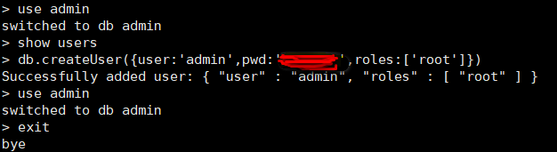
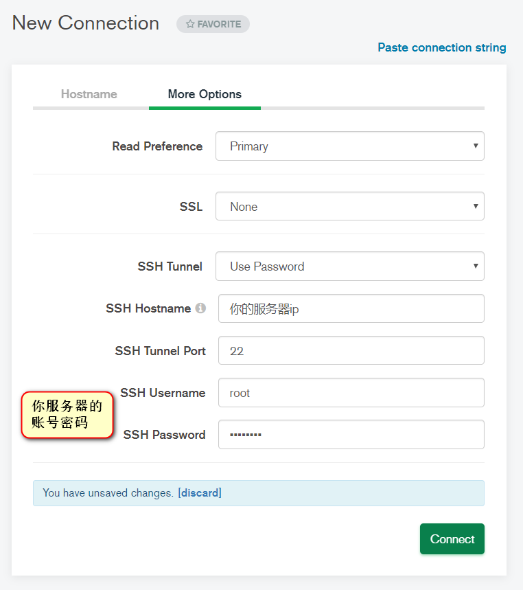

## 前言

自己做的小破站居然被黑了


还有留言

```
All your data is a backed up. You must pay 0.026 BTC to 1nPijsi2iwMKnAmpukxg4MRvwFyAQKvRU 48 hours for recover it. After 48 hours expiration we will leaked and exposed all your data. In case of refusal to pay, we will contact the General Data Protection Regulation, GDPR and notify them that you store user data in an open form and is not safe. Under the rules of the law, you face a heavy fine or arrest and your base dump will be dropped from our server! You can buy bitcoin here, does not take much time to buy https://localbitcoins.com or https://buy.moonpay.io/ After paying write to me in the mail with your DB IP: recmydb+1p0dw@onionmail.org and you will receive a link to download your database dump.
```
主要原因是使用默认端口且没有设置账号密码，这样很容易被扫描到
## 解决方法

### 先创建用户

```
#进入MongoDB后台管理shell
/usr/local/mongodb5/bin/mongo
#切换
use admin
# 查询当前用户，没有用户的话创建用户
show users
# 创建用户
db.createUser({user:'admin',pwd:'xxxxx',roles:['root']})
# 再次查询，可以看到admin已经创建
show users
```



### 再开启账户验证

```
#修改配置文件
vi ./mongodb.conf
#开启auth
auth=true
#进入MongoDB后台管理shell
/usr/local/mongodb5/bin/mongo
# 关闭mongodb服务
use admin
db.shutdownServer()
exit
#启动mongodb
/usr/local/mongodb5/bin/mongod -f /usr/local/mongodb5/mongodb.conf
```

下面是我的配置：

```
port=27017 #端口
dbpath= /usr/local/mongodb5/db #数据库存文件存放目录，目录要给足权限
logpath= /usr/local/mongodb5/log/mongodb.log #日志文件存放路径，目录要给足权限
logappend=true #使用追加的方式写日志
fork=true #以守护进程的方式运行，创建服务器进程
maxConns=100 #最大同时连接数
journal=true #每次写入会记录一条操作日志（通过journal可以重新构造出写入的数据）。
#即使宕机，启动时wiredtiger会先将数据恢复到最近一次的checkpoint点，然后重放后续的journal日志来恢复。
storageEngine=wiredTiger  #存储引擎有mmapv1、wiretiger、mongorocks
bind_ip = 0.0.0.0  #这样就可外部访问了，例如从win10中去连虚拟机中的MongoDB，127.0.0.1只允许本机访问
auth=true
```

再看看实际效果图：


可以看到上面没有权限无法操作


而在输入正确的账号密码后就可以正常操作了

附上mongodb compass连接配置：




