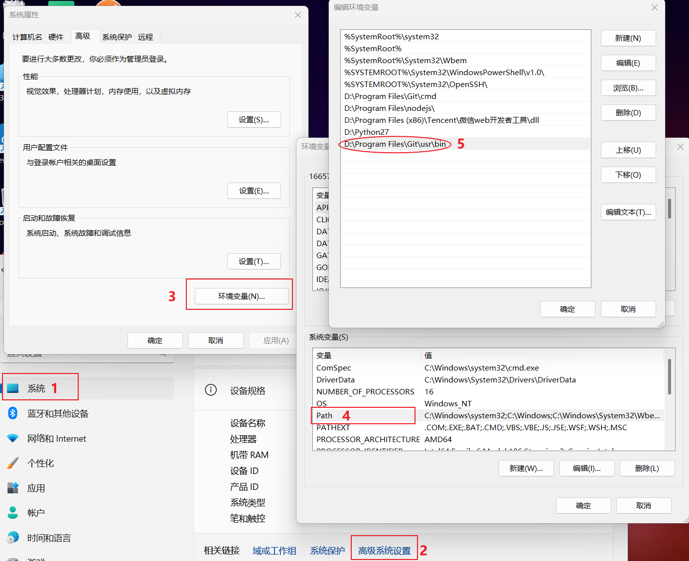
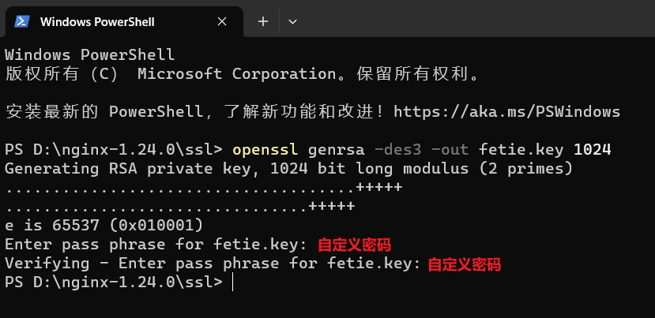

## 1. 使用openssl

使用git自带的openssl，但因为在git bash内执行交互式命令无响应，所以还需要给openssl配置环境变量方便全局使用。

### 1.1 检查openssl

找个文件夹使用git bash here

检查git内是否有openssl

```
git --version
#不用git bash使用cmd输入以下命令会提示没有这个命令
openssl version -a
```


### 1.2 配置环境变量

找到openssl的安装目录并复制路径


按以下步骤配置环境变量，在第五步粘贴刚刚的路径



## 2. 生成https证书

在nginx下创建ssl文件夹用于存放证书

> 注意：文件路径不能含有空格或者中文

### 2.1 创建私钥

```
openssl genrsa -des3 -out fetie.key 1024
```



### 2.2 创建 csr 证书

```
openssl req -new -key fetie.key -out fetie.csr
```

里面问题看着填


### 2.3 删除密码

复制 fetie.key 并重命名 fetie.key.org

再执行以下命令

```
openssl rsa -in fetie.key.org -out fetie.key
```


### 2.4 生成 crt 证书

```
openssl x509 -req -days 365 -in fetie.csr -signkey fetie.key -out fetie.crt
```


## 3. 修改nginx配置

在nginx.conf配置文件的http里增加如下配置

```
server {
        listen       443 ssl;
        server_name  abc.cn;

        ssl_certificate      D:/nginx-1.24.0/ssl/fetie.crt;	#证书的crt目录
        ssl_certificate_key  D:/nginx-1.24.0/ssl/fetie.key;	#证书的key目录

      	ssl_session_timeout 5m;
        ssl_ciphers ECDHE-RSA-AES128-GCM-SHA256:ECDHE:ECDH:AES:HIGH:!NULL:!aNULL:!MD5:!ADH:!RC4;
        ssl_protocols TLSv1 TLSv1.1 TLSv1.2;
        ssl_prefer_server_ciphers on;
	
	location / {
          proxy_redirect off;
          proxy_set_header Host               $host;
          proxy_set_header X-Real-IP          $remote_addr;
          proxy_set_header X-Forwarded-For    $proxy_add_x_forwarded_for;
          proxy_set_header X-Forwarded-Proto  $scheme;
          proxy_read_timeout          1m;
          proxy_connect_timeout       1m;
          proxy_pass  http://127.0.0.1:8080;	#自己启动的项目
      }
}
```

重启nginx

```
nginx -s reload
```

配置本地hosts

```
127.0.0.1 abc.cn
```

输入配置的域名访问


> 注意：因为上面没有配置http，所以配置好后要在地址里加上https访问