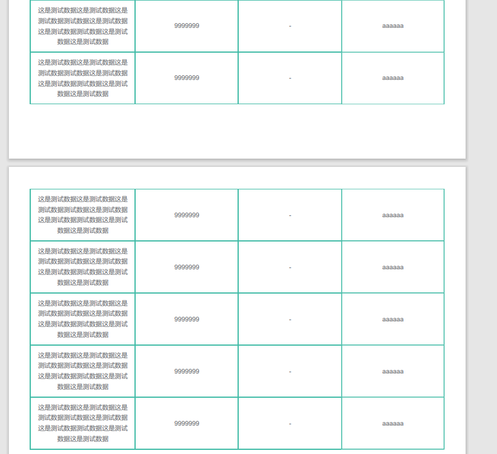
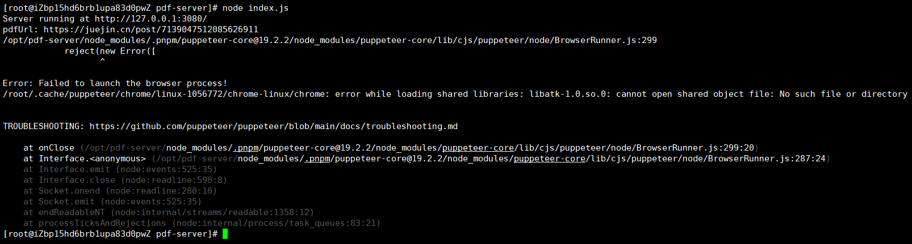
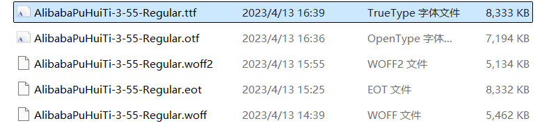
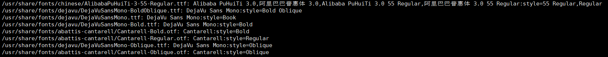
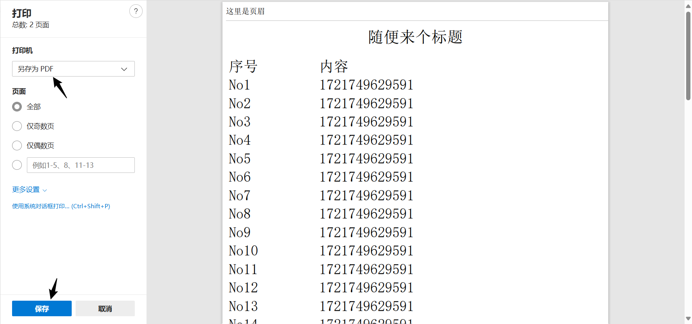
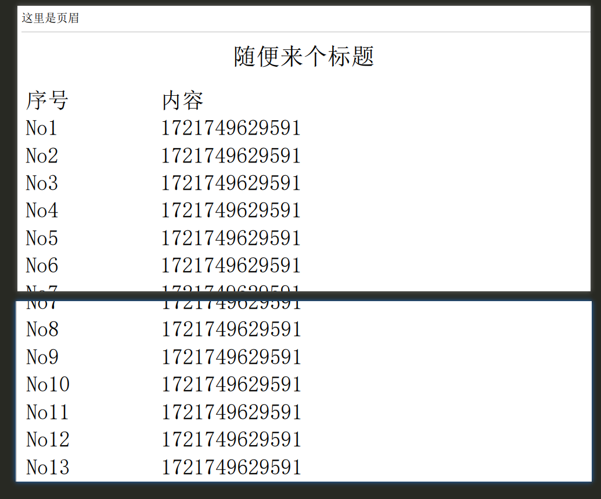

将html页面转成pdf文件网上有许多方法，但我实际使用后发现各有各的问题，经过多方体验后选出了使用puppeteer来将html导出pdf文件。

# 使用puppeteer导出pdf

代码仓库：[gitee](https://gitee.com/fetie/html-to-pdf)	[github](https://github.com/fetie/html-to-pdf)

我在这里分享一个非常简单的pdf的node服务，安装版本如下

```
"node":"16.20.2",
"npm":"8.19.4",
"pnpm":"8.15.8",
"node":"16.20.2",
"pm2":"5.4.2"
```

```
"puppeteer": "19.2.2",
//如果不需要去请求其他服务的话，下面两个不用装
"axios": "0.24.0",
"form-data": "4.0.0",
```

代码

```

const http = require('http')
const url = require('url')
const querystring = require('querystring')
const server = http.createServer((req, res) => {
  // 解析请求，包括路径名和查询参数
  const parsedUrl = url.parse(req.url)

  // 解析查询参数
  const queryParams = querystring.parse(parsedUrl.query)
  // 判断请求是否为PDF请求
  if (parsedUrl.pathname === '/create-pdf') {
    const pdfUrl = 'https://www.fetie.cn/note'
    console.log('pdfUrl:', pdfUrl)
    // 使用函数转换指定的URL
    urlToPDF(pdfUrl, queryParams).then((response) => {
      console.log('PDF已生成：', response)
      //Access-Control-Allow-Origin允许跨越（主要方便本地联调）
      res.writeHead(200, {
        'Content-Type': 'application/json; charset=utf8',
        'Access-Control-Allow-Origin': '*'
      })
      res.end(JSON.stringify(response))
    })
  }
})

const hostname = '127.0.0.1'
const port = 3080
server.listen(port, hostname, () => {
  console.log(`Server running at http://${hostname}:${port}/`)
})

const puppeteer = require('puppeteer')

async function urlToPDF(url, params) {
  // 启动浏览器
  const browser = await puppeteer.launch({ headless: true,args: ['--no-sandbox'] })
  // 打开新页面
  const page = await browser.newPage()
  /* await page.setViewport({
    width: 1920,
    height: 1080
  })*/
  //打开的页面需要设置cookie
  const cookie = {
    name: 'Admin-Token',
    value: params.token||'',
    domain: hostname,
    path: '/',
    expires: -1 // Session cookie
  }
  await page.setCookie(cookie)
  // 导航到URL
  await page.goto(url, { waitUntil: 'networkidle2' })

  // 页眉模板（图片使用base64）
    const headerTemplate = `<div
style="width: calc(100% - 28px); margin-top: -13px; font-size:8px;border-bottom:2px solid #e1dafb;padding:6px 14px;display: flex; justify-content: space-between; align-items:center;">
<span style="color: #9a7ff7; font-size: 12px; font-family: my-font;">这里是页眉</span>

</div>`
    // 页脚模板（pageNumber处会自动注入当前页码）
    const footerTemplate = `<div 
style="width:calc(100% - 28px);margin-bottom: -20px; font-size:8px; padding:15px 14px;display: flex; justify-content: space-between; ">
<span style="color: #9a7ff7; font-size: 10px;">这里是页脚</span>
<span style="color: #9a7ff7; font-size: 13px;" class="pageNumber"></span> 
</div>`;
  // 将页面保存为PDF
  const fileBuffer = await page.pdf({
    headerTemplate,
    footerTemplate,
    scale: 1,
    margin: {
      top: '10mm',
      right: '1mm',
      bottom: '10mm',
      left: '1mm'
    },
    landscape: false,
    format: 'A4',
    displayHeaderFooter: true,
    printBackground: true,
    timeout: 300000 // 5 分钟
  })

  /*// 关闭浏览器
  await browser.close()
  //直接返回
  return fileBuffer*/

  /*let returnData = ''
  //上传oss
  uploadOss(fileBuffer,params).then((response) => {
    console.log('response:',response);
    returnData=response
    // 关闭浏览器
    browser.close()
  })
  return returnData*/
  const fileName=`${Date.now()}.pdf`
  // 写入文件系统
  require('fs').writeFileSync(fileName, fileBuffer)
  await browser.close()
  return {
    code: 200,
    msg: 'pdf生成成功',
    data: fileName
  }
}

const axios = require('axios')
const FormData = require('form-data')
//因为部署在在同一个服务器上，所以直接内网调用
const apiHost = '127.0.0.1:8080'
// const apiHost = 'dev.hcs.dahealth.tech'
//上传oss
async function uploadOss(fileBuffer,params){
  const form = new FormData()
  form.append('file', fileBuffer, `${Date.now()}.pdf`)
  form.append('type', 'user')
  // 设置请求头（form 会自动设置Content-Length）
  const headers = {
    ...form.getHeaders(),
    authorization: 'Bearer ' + params.token
  }
  let pdfRes = ''
  await axios.post(`http://${apiHost}/management/ali/oss/upload`, form, { headers })
    .then(response => {
      console.log('Success:', response.data)
      pdfRes = response.data

    })
    .catch(error => {
      console.error('Error:', error)
    })

  return pdfRes
}
```

## 前端样式问题

html转为pdf后页面是分页显示的，而分页后在html里是连贯的部分转为pdf后可能就会断开。


像上面这样表格线条断开的情况可加入下面的样式，但如果border只有1px会出现分页处上面有border而下面没border得情况，这里我是把border设为了2px

```
table tr{
	page-break-inside:avoid;
}
```



## windows

1. 拉下代码
2. 进入对应目录
3. `pnpm i`或者`npm i`
4. node index.js

到这就会启动3080端口，可以直接通过访问以下链接即可生成pdf

http://127.0.0.1:3080/create-pdf?link=https://element.eleme.cn/#/zh-CN/component/table

## centos

### yum安装chromium

因为pupeteer是基于Chrome工作，理论上使用npm安装pupeteer的时候是会自动装chromium，但chromium可能会安装失败。运行代码的时候就会报类似下面这样的错



这时就需要自己手动安装chromium

#### 1.是否安装EPEL

先检查是否安装EPEL，如果EPEL仓库已安装，下面的命令会输出EPEL仓库的信息。如果没有安装EPEL仓库，该命令不会输出任何内容。

```
yum repolist | grep -i epel
```

#### 2.安装EPEL

如果发现没安装EPEL，执行以下命令

```
安装EPEL仓库
yum install epel-release
接下来，更新系统
yum update
```

#### 3.安装Chromium

```
yum install chromium
```

### 设置中文字体

如果你发现导出的pdf文件有好多字不显示，那是因为Linux系统上没有安装中文字体

#### 1.下载字体

使用免费的阿里普惠体

https://puhuiti.oss-cn-hangzhou.aliyuncs.com/AlibabaPuHuiTi-3/AlibabaPuHuiTi-3-55-Regular.zip

#### 2.上传ttf文件



将压缩包里的ttf字体文件上传到服务器

```
cd /usr/share/fonts/
mkdir chinese
```

利用远程工具将字体文件上传到刚刚新建的`chinese`文件夹下（如果发现不能传过去，应该是远程工具没有 root 权限，可以先传到 home 目录下的某个自己创建的新文件夹里，再自己利用 sudo 权限把文件移动到 /usr/share/fonts/chinese/ 目录下）

#### 3.更改字体权限

```
chmod 755 /usr/share/fonts/chinese/*
```

#### 4.建立 scale 文件

在`/usr/share/fonts/chinese/`目录中执行以下命令

```
mkfontscale
```

```
# 提示 not found就执行以下命令
yum install mkfontscale 
```

#### 5.建立dir文件

在`/usr/share/fonts/chinese/`目录中执行以下命令

```
mkfontdir
```

```
# 提示 not found就执行以下命令
yum install mkfontscale
```

#### 6.运行 fc-cache

在`/usr/share/fonts/chinese/`目录中执行以下命令

```
fc-cache
```

```
# 提示 not found就执行以下命令
yum install fontconfig
```

最后执行以下命令可以看到刚刚加入的字体

```
fc-list
```



### pm2管理服务

#### 赋权

先赋予主文件权限

```
chmod 755 index.js
```

#### 启动服务

使用`pm2`启动服务

```
# 这里--name pdf-server表示给启动的服务起一个叫pdf-server的名字，不带这个参数则这个服务名会使用文件名
pm2 start index.js --name pdf-server
```

#### nginx配置

如有需要可在nginx可用域名中增加如下配置

```
location /create-pdf{
    proxy_set_header Host $http_host;
    proxy_set_header X-Real-IP $remote_addr;
    proxy_set_header REMOTE-HOST $remote_addr;
    proxy_set_header X-Forwarded-For $proxy_add_x_forwarded_for;
    proxy_pass http://127.0.0.1:3080;
}
```

增加配置后，访问`http://xx.com/create-pdf`的请求就会被nginx转发到3080端口

# 其他方法

## window.print()

使用原生的`window.print()`基本上能符合需求，但也有缺点，那就是得用户手动下载pdf。



**示例代码**

```
<html>
  <head>
    <title>print pdf</title>
    <meta name="description" content="print打印，支持自定义页眉页脚" />
    <meta http-equiv="Content-Type" content="text/html;charset=UTF-8" />
    <meta
      name="viewport"
      id="WebViewport"
      content="initial-scale=1, maximum-scale=1, minimum-scale=1, user-scalable=no"
    />
    <style>
      @media print {
        @page {
          size: A4 portrait;
          /* 调整页边距 */
          margin: 0;
        }

        #printDom {
          display: block !important;
        }
      }

      #printDom {
        /* 打印区域在非打印时不显示 */
        display: none;
        position: relative;
        font-size: 16px;
      }

      #printDom .page-header {
        /* 页眉高度 */
        height: 1cm;
        display: flex;
        align-items: center;
        position: fixed;
        top: 0mm;
        width: 100%;
        border-bottom: 1px solid #ddd;
        z-index: 2000;
      }

      #printDom .page-header-space {
        /* 控制内容区距离顶部的距离，防止与页眉重叠 */
        height: 1cm;
      }

      #printDom .page-footer {
        /* 页脚高度 */
        height: 1cm;
        position: fixed;
        bottom: 0;
        width: 100%;
        border-top: 1px solid grey;
        z-index: 2000;
      }

      #printDom .page-footer-space {
        /* 控制内容区距离底部的距离，防止与页脚重叠 */
        height: 1.5cm;
      }

      #printDom > table {
        width: 100%;
      }
      
      #printDom .content table {
        width: 100%;
        font-size: 30px;
      }

      #printDom .content .header {
        text-align: center;
      }
    </style>
  </head>
  <body>
    <button onclick="handlePrint()" class="print-pdf-btn">打 印</button>
    <div id="printDom">
      <!-- 页眉 -->
      <div class="page-header">这里是页眉</div>
      <table>
        <!-- 占位，给页眉留出位置 -->
        <thead>
          <tr>
            <td><div class="page-header-space"></div></td>
          </tr>
        </thead>
        <!-- start: 正文 -->
        <tbody>
          <tr>
            <td>
              <div class="content">
                <!-- 正文的标题 -->
                <h1 class="header">随便来个标题</h1>
                <div>
                  <!-- 正文内容，可随意写，demo是表格 -->
                  <table>
                    <thead>
                      <tr>
                        <td>序号</td>
                        <td>内容</td>
                      </tr>
                    </thead>
                    <tbody id="tableBody">
                    </tbody>
                    <tfoot></tfoot>
                  </table>
                </div>
              </div>
            </td>
          </tr>
        </tbody>
        <!-- end: 正文 -->
        <!-- 占位，给页脚留出位置 -->
        <tfoot>
          <tr>
            <td><div class="page-footer-space"></div></td>
          </tr>
        </tfoot>
      </table>
      <!-- 页脚 -->
      <div class="page-footer">这里是页脚</div>
    </div>

    <script>
      //需要注意window.print()打印是以body标签里的内容进行打印的
      function handlePrint() {
        printElement('#printDom');
      }
      /*
      //该printElement方法与下面的方法都可以使用，只不过原理不同
      function printElement() {
        document.querySelector('.print-pdf-btn').style.display = 'none'
        window.print()
        setTimeout(() => {
          document.querySelector('.print-pdf-btn').style.display = 'inline-block'
        })
      }*/
      /**
       * 打印指定元素
       * @param {string} element 需要打印的元素选择器
       */
      function printElement(element) {
        var printContents = document.querySelector(element).cloneNode(true);
        
        var popupWin = window.open('', '_blank');
        popupWin.document.open();
        
        const styles = document.head.innerHTML;
        popupWin.document.write(`<html><head><title>Print Title</title>${styles}</head><body onload="window.print(); window.close();">`);
        popupWin.document.body.appendChild(printContents);
        popupWin.document.write('</body></html>');
        
        popupWin.document.close();
      }

      const tempTableData = document.querySelector('#tableBody');
      const tempFragument = document.createDocumentFragment();

      // mock data
      for (let i = 0; i < 30; i++) {
        const _tr = document.createElement('tr');
        const _td1 = document.createElement('td');
        _td1.appendChild(document.createTextNode(`No${i + 1}`));
        const _td2 = document.createElement('td');
        _td2.appendChild(document.createTextNode(new Date().getTime()));
        _tr.appendChild(_td1);
        _tr.appendChild(_td2);
        tempFragument.appendChild(_tr);
      }

      tempTableData.appendChild(tempFragument);
    </script>
  </body>
</html>

```


如果你的需求是想要生成pdf后自动上传到服务器那这个方案就不行。

## html2canvas+jsPDF

我自己使用时发现了两个比较大的问题

### 1.生成后无法编辑

该方案实际是先把html先转成了图片，再把图片转成pdf，但这样生成的pdf是没法再对里面的文字进行编辑的。

### 2.分页截断

在html里内容是连贯的，但在转成pdf后会被截断。因为该方法是将固定高度的html转成了图片，所以就有可能会出现一段文字被截成了两断，如图：



当然解决办法就是在转成图片之前就要把页面分好页，这里的方法就要根据自己的项目再具体分析了，总之方法比较复杂，我就没有采用。

## pdfmake

使用pdfmake也有两个问题

### 1.中文支持不方便

我在网上看到比较多的让pdfmake支持中文的方案是要进入`/node_modules/pdfmake/`目录后输入各项命令来生成支持中文的字体文件。但`node_modules`作为扩展包目录按理应该是要被我们忽略的。现在却需要通过它来生成字体文件显然不太合适。

### 2.图片文件需要手动引入

如果你的html页面内容有一部分是通过富文本生成的，那富文本里的图片文件就没法自己再手动引入了。

